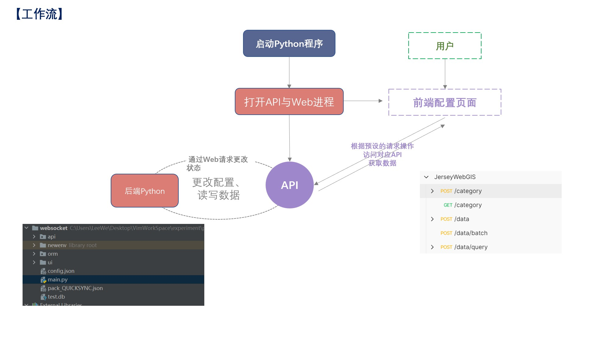

# JerseyWebGIS

### 说明 Annotation

易于部署的地物数据收集系统。特色在于只需要Python环境便可以运行，全程（？）可视化操作流程收集地物数据。



存在许多缺陷。纯粹只是实践自己想法的玩具。

### 环境 Preliminaires

Python >=3.6

```bash
pip install SqlAlchemy=2.0.0b3

pip install Flask

pip install flask_cors

pip install flask_sock
```


### 运行 QuickStart

使用Python运行main.py即可。